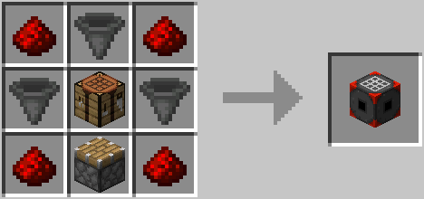
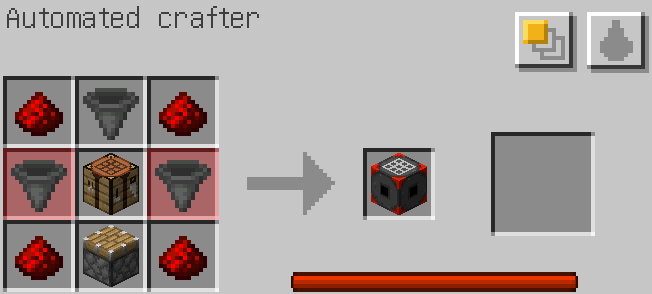

# AdiCrafter

This mod adds only one block: the automated crafter.

The automated crafter pulls ingredients from neighboring containers and inventories, including chests, hopper and other
automated crafters, and any other blocks that implements the Fabric transfer API.

### Crafter configuration

You can select the recipe to craft by opening the configuration screen. Simply right-click (use) the block.

#### Recipe

Edit the crafting grid on the left. The result of any valid recipe will show on the middle slot, and the right slot can
be used to manually craft the recipe.

Note that the right slot will not show anything if there is no enough ingredients available. Missing ingredients are
highlighted in the crafting grid.

#### Fuzzy mode

By default, the automated crafter tries to find the exact items used in its crafting grid, but the "fuzzy" option allows
to use any compatible items, e.g. using any kind of plank to craft a chest.

#### Fluid substitution

There is also an option to replace anything fluid container items (buckets, bottles, ...) by pulling fluids from
neighboring tanks, like cauldrons.

This is of limited use with vanilla minecraft, but it can become handy with third-party mods that add a lot of new
fluids and recipe.

#### Internal power

The automated crafter has an internal storage of power that steadily refills over time. Crafting an object consumes some
of this power. With the default configuration, a fully-loaded crafter can craft 10 items in a row.

This can be disabled or tweaked in the configuration file.

### Activation

The automated crafter will not craft anything unless you try to pull some items from it. You can do so manually, or by
using other item extracting blocks, like the hopper.

### Mod configuration

The mod reads its configuration from the file config/adicrafter.json. It creates it if it does not exist.

### Download

* [Github Releases](https://github.com/Adirelle/AdiCrafter/releases)
* [Modrinth](https://modrinth.com/mod/vDM7AFKM)

### License

Unless explicitly stated otherwise all files in this repository are licensed under the MIT License (MIT).
